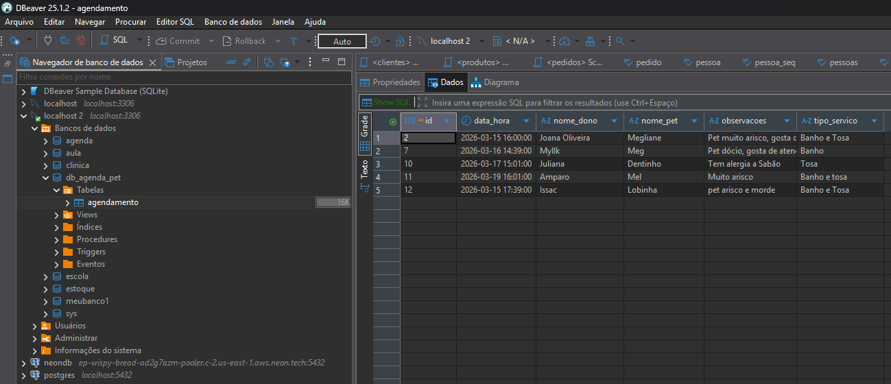

# 📅 Sistema de Agendamento para Pet Shop

Sistema simples de **agendamento de serviços para pets**, permitindo cadastrar, visualizar, editar e excluir agendamentos.

O sistema registra informações como:

- 🐶 Nome do Pet  
- 👤 Nome do Dono  
- ✂️ Tipo de Serviço (Banho, Tosa, etc.)  
- 📅 Data e Hora  
- 📝 Observações (alergias, comportamento, etc.)

---

# 🚀 Tecnologias Utilizadas

## Backend
- Java 8  
- Spring Boot  
- JPA / Hibernate  
- MySQL  

## Frontend
- HTML  
- CSS  
- JavaScript  

## Ferramentas
- DBeaver (gerenciamento do banco)
- VS Code
- Maven

---

# 📷 Imagens do Sistema

## Banco de Dados



---

# 📊 Estrutura da Tabela

Tabela principal:

`agendamento`

| Campo        | Tipo     |
|--------------|----------|
| id           | INT      |
| data_hora    | DATETIME |
| nome_dono    | VARCHAR  |
| nome_pet     | VARCHAR  |
| observacoes  | TEXT     |
| tipo_servico | VARCHAR  |

---

# ⚙️ Funcionalidades

✔️ Criar novo agendamento  
✔️ Listar agendamentos  
✔️ Editar agendamento  
✔️ Excluir agendamento  
✔️ Registrar observações do pet  

---

# 🖥️ Interface do Sistema

O sistema possui uma interface simples para facilitar o uso no dia a dia de um pet shop.

- Cadastro rápido de agendamento
- Listagem dos agendamentos do dia
- Botões de **Editar e Excluir**

---

# 📦 Como Executar o Projeto

## 1️⃣ Clonar o repositório

```bash
git clone https://github.com/seu-usuario/seu-repositorio.git
